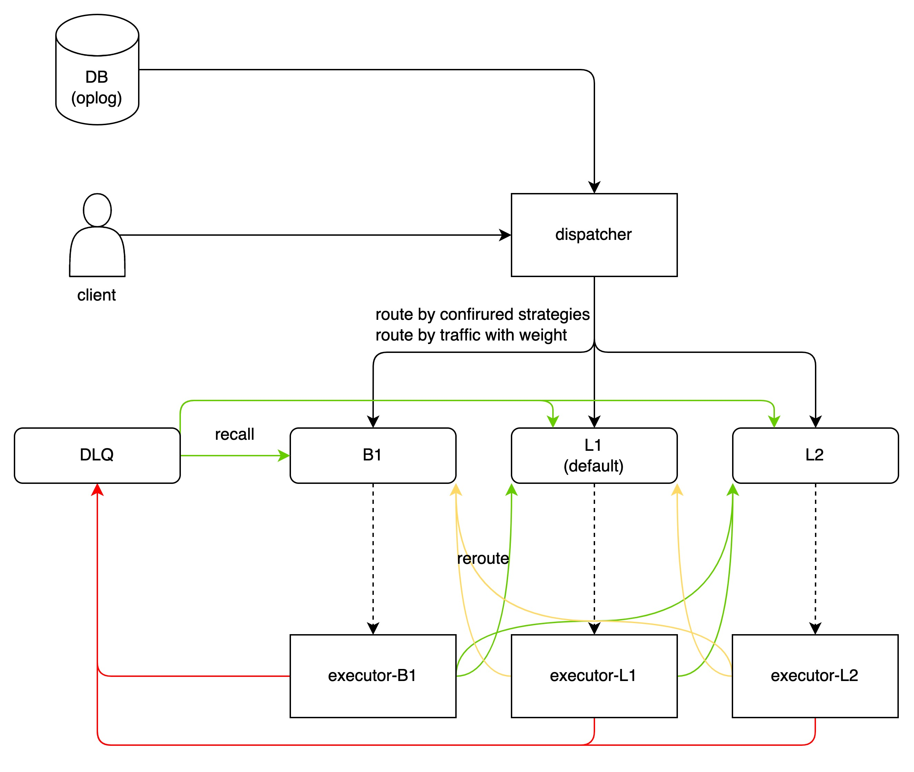

### 整体架构

### 消息状态

### 处理流程

### 隔离策略
说明： 
- 通过楼层模拟不同uid或者itbl消息的综合属性，将消息划分为同步的等级，同时将统一业务属性的消息打散到不同的Topic中。
  理论上，楼层越高，消息的综合处理性能越好。
  综合处理性能包括worker端的处理能力、worker干系内外服务处理能力。
- 

#### 分级隔离
- 单级队列

- 单级队列 + backup

- 双级队列 + backup

#### 升降隔离
- 处理过程中遇到报错时，同时访问本地缓存或者consul中的消息打散配置参数，将指定的UID/BucketID消息重新路由到其他(非当前主题)主题中。
#### 并发隔离
#### 限额隔离
