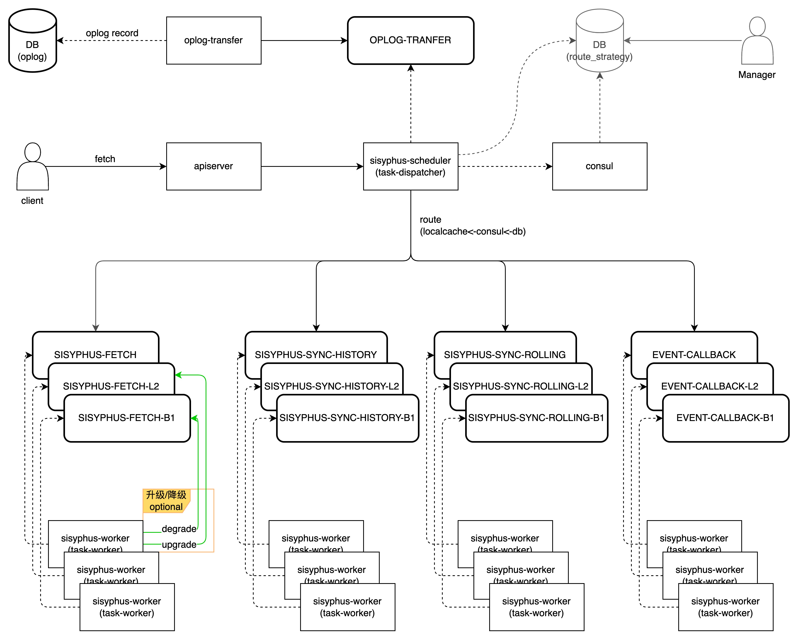
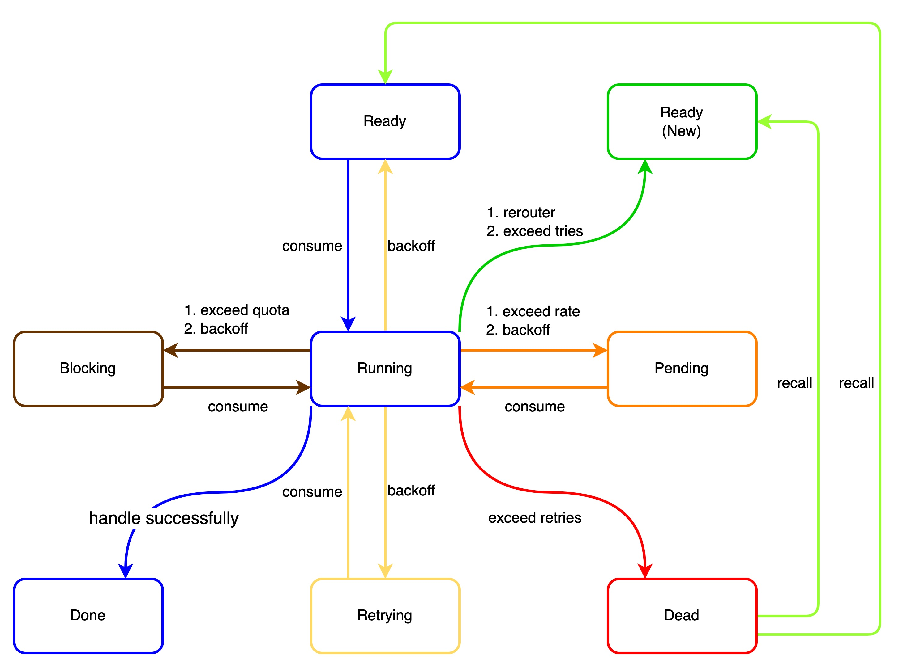
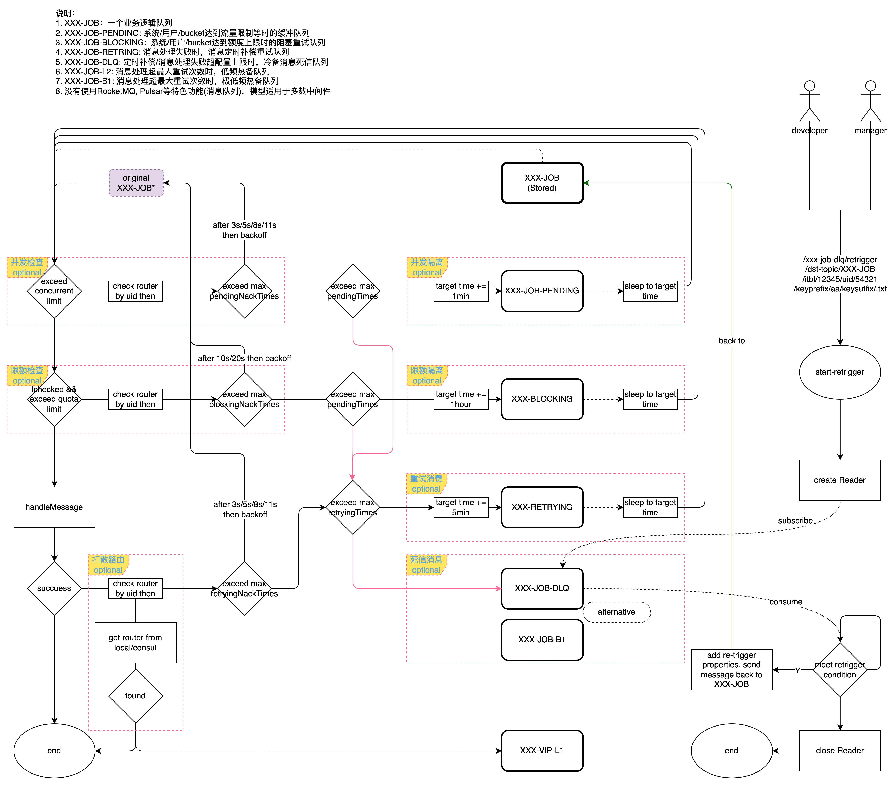
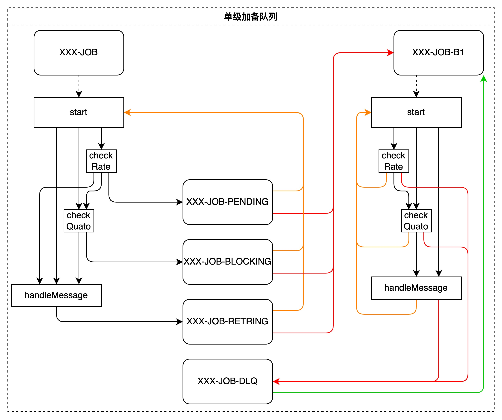

### 整体架构

### 消息状态

### 处理流程

### 隔离策略
#### 分级隔离
- 单级队列

- 单级队列 + backup

- 双级队列 + backup

#### 升降隔离
- 处理过程中遇到报错时，同时访问本地缓存或者consul中的消息打散配置参数，将指定的UID/BucketID消息重新路由到其他(非当前主题)主题中。
#### 并发隔离
#### 限额隔离
